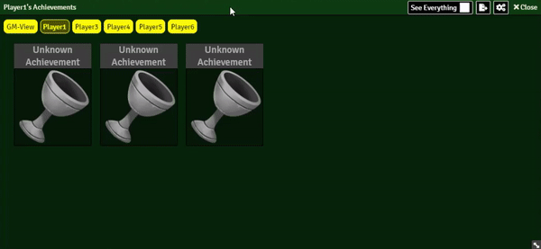

# Farchievements

<b>Create and reward players with achievements:</b>

## Installation

It's always easiest to install modules from the in game add-on browser.

To install this module manually:
1.  Inside the Foundry "Configuration and Setup" screen, click "Add-on Modules"
2.  Click "Install Module"
3.  In the "Manifest URL" field, paste the following url:
`https://raw.githubusercontent.com/p4535992/foundryvtt-farchievements/master/src/module.json`
4.  Click 'Install' and wait for installation to complete
5.  Don't forget to enable the module in game using the "Manage Module" button

# Features

<h1>Images and Gifs:</h1>

Foundry Achievements Button: 
</img>

Player View: 
</img> 

GM VIEW:                                      
</img> 

GM VIEW Edit mode
</img> 

## Issues

Any issues, bugs, or feature requests are always welcome to be reported directly to the [Issue Tracker](https://github.com/p4535992/foundryvtt-farchievements/issues ), or using the [Bug Reporter Module](https://foundryvtt.com/packages/bug-reporter/).

## License

- **[Handyfon](https://github.com/Handyfon/Farchievements)**: [GPL 3.0](https://github.com/Handyfon/Farchievements/blob/main/LICENSE)

This package is under an [GPL 3.0](LICENSE) and the [Foundry Virtual Tabletop Limited License Agreement for module development](https://foundryvtt.com/article/license/).

## Credits

- [Handyfon](https://github.com/Handyfon/) for the module [Farchievements](https://github.com/Handyfon/Farchievements)
